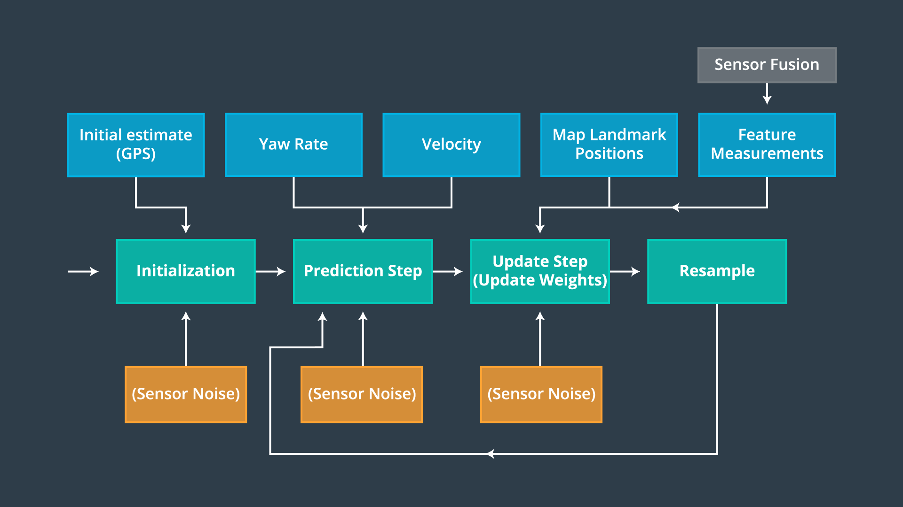

# Project 6 - Kidnapped Vehicle

This project from Udacity‘s Self-Driving Car Engineer Nanodegree program implements a localization technique in C++ to find a kidnapped self-driving car. The project covers the implementation of a 2D particle filter, localization with a given map and (noisy) GPS estimate of location and testing in a simulator.

----

## 1 - Project Overview

### Goals:

* Build a particle filter that can localize a vehicle by lidar and GPS input and given landmarks on a map
* Reach a given performance 
* Test the particle filter in a simulator brovided by Udacity

### Structure:

The project is divided into different files. The simlator can be found [here](https://github.com/udacity/self-driving-car-sim/releases/).

* `src/particle_filter.cpp`: the particle filter (with header file)
* `src/main.cpp`: the routine with connection to the simulator
* other helper, build and installation files

---

## 2 - Rubic Points

Here I will consider the [rubric points](https://review.udacity.com/#!/rubrics/747/view) individually and describe how I addressed each point in my implementation.

#### 2.1 - Compiling

**1.) Does your particle filter localize the vehicle to within the desired accuracy?**

This is checked automatically when you run the run.sh file. Here are some images during runtime and at success:


More Details about the implementation can be found below.

#### 2.2 - Performance

**1.) Does your particle run within the specified time of 100 seconds?**

This criteria is also check automatically. In the image above you can see, that the implementation managed to complete the course in almost half of the required time.

#### 2.3 - General

**1.) Does your code use a particle filter to localize the robot?**

I implemented the particle filter in the `particle_filter.cpp` file. The algorithm is shown in the following flowchart (from Udacity):



How I implemented the four steps initialization, prediction, update and resample is now explained:

The function `ParticleFilter::init(double x, double y, double theta, double std[])` takes in an initial estimated GPS position x,y and theta (orientation) and the standard deviation of them. I use these values to create 100 particles and **initialize** them with a normal distributed position (lines 30-52):

 ```c++ 
// number of particles
num_particles = 100;
    
// initialization of normal distributions
normal_distribution<double> dist_x(x, std[0]);
normal_distribution<double> dist_y(y, std[1]);
normal_distribution<double> dist_theta(theta, std[2]);

// initialization of particles
for (int i = 0; i < num_particles; i++) {
  Particle particle;
  particle.id = i;
  particle.x = dist_x(generator);
  particle.y = dist_y(generator);
  particle.theta = dist_theta(generator);
  particle.weight = 1.0;

  particles.push_back(particle);
  weights.push_back(1.0);
}

// set particle filtes initialized
is_initialized = true;
 ```

The next step is to **predict** the positions of the particles after an elapsed time and moving the vehicle. This is implemented in lines 56-87. First I calculate the new positions according to the elapsed time, the vehicles velocity and yaw rate and the add the sensor noise to the calculation.

```c++ 
 // initialization variables
double p_x, p_y, theta, std_x, std_y, std_theta, new_x, new_y, new_theta;
std_x = std_pos[0];
std_y = std_pos[1];
std_theta = std_pos[2];

// Predict each particle
for (int i = 0; i < num_particles; i++) {
  	p_x = particles[i].x;
    p_y = particles[i].y;
    theta = particles[i].theta;

    // if yaw rate is almost 0, ignore it
    if (fabs(yaw_rate) < 0.00001) {
        new_x = p_x + (velocity * delta_t * cos(theta));
        new_y = p_y + (velocity * delta_t * sin(theta));
    } else {
        new_x = p_x + (velocity/yaw_rate) * (sin(theta + (yaw_rate*delta_t)) - sin(theta));
        new_y = p_y + (velocity/yaw_rate) * (cos(theta) - cos(theta + (yaw_rate*delta_t)));
        new_theta = theta + yaw_rate*delta_t;
    }

  // calculate predicted location with noise
  normal_distribution<double> dist_x(new_x, std_x);
  normal_distribution<double> dist_y(new_y, std_y);
  normal_distribution<double> dist_theta(new_theta, std_theta);

  // add noise
  particles[i].x = dist_x(generator);
  particles[i].y = dist_y(generator);
  particles[i].theta = dist_theta(generator);
}
```

Step three is the **update step**. Here I update the weights of each particle according to how likely the are. This is done by "next neighbour" where the nearest predicted particle to the sensed landmark is chosen as best estimation. "Next neighbour" is not the best way because sometimes the nearest particle is not always the best choice but it works in the most situations. The whole code can be found in lines 90 to 172. Here I just want to point out some lines:

```c++ 
// transform observations to world coordinates
vector<LandmarkObs> transformed_obs;
for (int j = 0; j < observations.size(); j++) {
  // calculate x,y
  double trans_x = observations[j].x * cos(p.theta) - observations[j].y * sin(p.theta) + p.x;
  double trans_y = observations[j].x * sin(p.theta) + observations[j].y * cos(p.theta) + p.y;
  transformed_obs.push_back(LandmarkObs{observations[j].id, trans_x, trans_y});
}
```

Since the observed landmarks are in vehicle coordinates, the observations have to be transformed to the world coordinates, which happens in lines 137-144.

The "next neighbour" data association technique is implemented in lines 90-111.

The weight of each particle is calculated as product of the multivariate gaussian of the prediction and all observations of landmarks (line 167 and the function `double calculateMultivariateGaussian(double x, double y, double mu_x, double mu_y, double sigma_x, double sigma_y)` in lines 113-116).

The last step is to **resample** the particles according to their weight. This is implemented in the `ParticleFilter::resample()` function in lines 174 to 189. I use the build-in discrete_distribution to pick the particles randomly but weighted by their weight from the particle array. By this I prefer particles with a higher weight.

```c++ 
// init distribution
discrete_distribution<> resample_index_dist(weights.begin(), weights.end());

// init variable
vector<Particle> resambled_particles;

// for each particle...
for (int i = 0; i < num_particles; i++) {
  // choose particles randomly but weighted from particle array (particle with higher weight is more likely than a particle with lower weight)
  int index = resample_index_dist(generator);
  resambled_particles.push_back(particles[index]);
}
// update particles array
particles = resambled_particles;
```